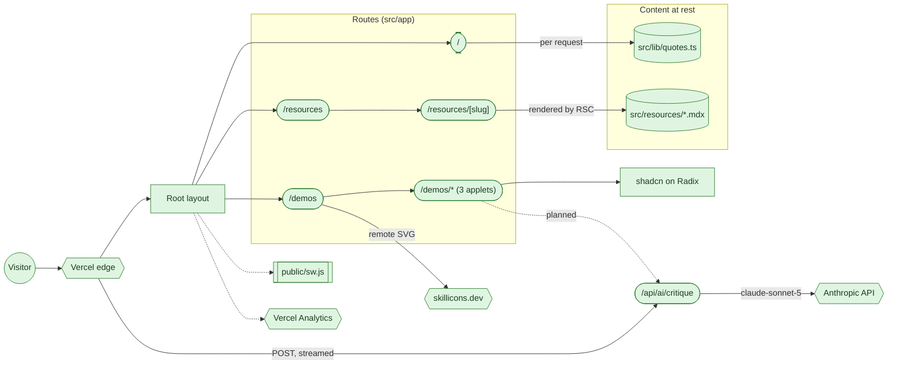
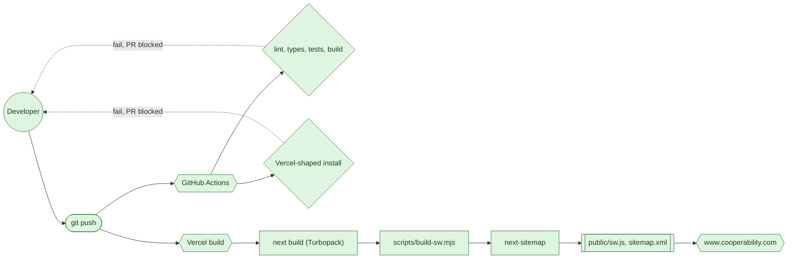

# [Co-Operability.com](https://www.cooperability.com)

My Next.js portfolio on Vercel, with several smaller projects inside it: a
prompt-composition tool, an opioid dose converter, and a Mandelbrot explorer.
Each one also installs as its own Progressive Web App.

**Stack:** Next.js 16 App Router · React 19 · TypeScript · Tailwind 3 ·
shadcn/ui on Radix · MDX · Serwist · pnpm 11 · Node 22 · Vercel.

---

## How the site fits together



**Legend.** Shape carries what a thing is: circle a person, stadium an entry
point, rectangle code in this repo, cylinder content at rest, double-bracket a
generated artifact, hexagon a third party. Colour carries status: green built,
grey dashed planned. VS Code renders these fences only with the
_Markdown Preview Mermaid Support_ extension. GitHub renders them natively.

**The edge boundary.** Every request lands on Vercel, which serves the static
routes from CDN and runs the rest as server components. `/` is the exception
that proves the rule: it carries `export const dynamic = 'force-dynamic'`
because the homepage quote is re-rolled per request, and without that flag it
prerenders and the quote freezes at build time.

**The layout boundary.** `src/app/layout.tsx` owns everything shared: the theme
provider (`next-themes`), the header, sidebar and footer from `src/sections/`,
the site metadata, and the analytics and service-worker registrations. Route
segments below it own only their own content and their own `metadata` export.
Metadata does not deep-merge, so a child that sets `icons` replaces the
layout's whole `icons` object. See [App Router Notes](docs/App-Router.md).

**The content boundary.** Nothing here is a database. Quotes are a TypeScript
array, and resource pages are MDX files on disk, read at request time by
`src/lib/resources.ts` with `gray-matter` for front matter and
`next-mdx-remote/rsc` for the body. Because the MDX is compiled on the server,
no MDX compiler ships to the browser.

**The AI boundary.** `/api/ai/critique` is the only route that leaves the
origin with caller input. It streams a prompt critique from `claude-sonnet-5`
through `src/lib/ai/`, which pins the system prompt server-side, fences caller
text inside the user turn, caps the body at 16 KB and the output at 2,048
tokens, and rate-limits per IP and per instance. It answers 503 until
`ANTHROPIC_API_KEY` is set, so an unconfigured deploy cannot spend. No UI calls
it yet.

**The trust boundary.** Three third parties are reached at runtime.
`skillicons.dev` serves the tech-stack SVGs on `/demos`, which is why
`next.config.js` sets `dangerouslyAllowSVG` behind a domain allowlist and a
`script-src 'none'` image CSP ([details](docs/Icons.md)). Vercel Analytics and
Speed Insights collect page metrics without cookies, which is the reason there
is no Google Analytics on this site. Anthropic's API is reached only from the
server, only on a request to the AI route above, and the key never reaches the
browser.

**The offline boundary.** `src/sw.js` is compiled to `public/sw.js` at build
time by Serwist, which injects a precache manifest of the built `.next/static`
assets. Each applet ships its own `.webmanifest` under `public/icons/`, so the
three demos install to a home screen as separate apps sharing one service
worker. See [PWA Suite](docs/PWA.md).

## How a change ships



**The CI gate.** `.github/workflows/ci.yml` runs two jobs on every pull request
and every push to `main`. The first is lint, typecheck, tests with coverage,
and a production build. The second reproduces Vercel's install shape
(`corepack prepare pnpm@11.24.0`, then `--frozen-lockfile`) and builds again,
because Vercel does not yet detect pnpm 11 from a 9.0 lockfile, so a local
build passing proves nothing about the deploy.

**The build chain.** `pnpm build` is three commands in order, and the order
matters: `next build` has to finish before Serwist can read the built assets it
precaches, and `next-sitemap` reads the build manifests after that. `dev` and
`build` run on Turbopack. Only `analyze` still pins `--webpack`, because
`@next/bundle-analyzer` is a webpack plugin. See
[PNPM Migration](docs/PNPM-MIGRATION.md).

---

## Quick start

```bash
corepack enable
corepack prepare pnpm@11.24.0 --activate
pnpm install --frozen-lockfile
pnpm dev
```

All pnpm configuration lives in `pnpm-workspace.yaml`. In pnpm 11, `.npmrc` is
registry and auth only, and the `pnpm` field in `package.json` is ignored.
Settings put in the wrong file fail silently.

## Developer tooling

Full documentation in **[docs/Tooling.md](docs/Tooling.md)**.

| Command                           | What it does                                      |
| --------------------------------- | ------------------------------------------------- |
| `pnpm dev`                        | Development server on `localhost:3000`            |
| `pnpm build`                      | Production build, service worker, sitemap         |
| `pnpm lint` / `pnpm lint:mdx`     | ESLint, including `jsx-a11y` and MDX              |
| `pnpm format` / `pnpm format:mdx` | Prettier, with MDX prose wrapping                 |
| `pnpm typecheck`                  | `tsc --noEmit`                                    |
| `pnpm test`                       | Jest, non-interactive. Safe unattended            |
| `pnpm test:ci`                    | The same run plus coverage                        |
| `pnpm test:watch`                 | The watcher. **Never run this unattended**        |
| `pnpm analyze`                    | Webpack bundle analyzer                           |
| `pnpm access`                     | Accessibility audit: ESLint, axe-core, Lighthouse |
| `pnpm audit:critical`             | Security scan, critical severity only             |

**Key technologies:**

- **Linting:** ESLint 10 flat config with TypeScript, Next.js and MDX support
- **Formatting:** Prettier with automatic MDX prose wrapping
- **Testing:** Jest with `@testing-library/react` and jest-dom matchers
- **Automation:** Husky (pre-commit, plus a pre-push security hook), lint-staged, GitHub Actions
- **Package management:** pnpm 11 with an isolated `node_modules` tree and one `pnpm-lock.yaml`
- **UI components:** shadcn/ui (Tailwind plus Radix primitives)
- **Bundle analysis:** Webpack Bundle Analyzer
- **Accessibility:** axe-core CLI and Lighthouse, run against a live dev server
- **Icons:** skillicons.dev, sourced from simple-icons.org

Pre-push hooks and GitHub Actions block vulnerable code. See
[docs/Tooling.md#security-auditing](docs/Tooling.md#security-auditing).

## Project dependencies

`package.json` is the source of truth. This table groups what is installed and
why, so a reader can tell load-bearing packages from incidental ones.

### Runtime (`dependencies`)

| Package                                                                                                     | Role                                                                 |
| ----------------------------------------------------------------------------------------------------------- | -------------------------------------------------------------------- |
| `next`, `react`, `react-dom`                                                                                | The framework and its renderer                                       |
| `tailwindcss`, `tailwindcss-animate`, `@tailwindcss/typography`                                             | Styling: utility CSS, animation utilities, prose defaults            |
| `@radix-ui/react-accordion`, `-checkbox`, `-label`, `-radio-group`, `-slot`, `-switch`, `-tabs`, `-tooltip` | Unstyled accessible primitives that shadcn/ui wraps                  |
| `class-variance-authority`, `clsx`, `tailwind-merge`                                                        | Variant and className composition the shadcn components rely on      |
| `@heroicons/react`, `lucide-react`                                                                          | Icon sets used in the chrome and the applets                         |
| `@mdx-js/loader`, `@mdx-js/react`, `@next/mdx`, `next-mdx-remote`                                           | MDX pipeline. `next-mdx-remote/rsc` is what `/resources/[slug]` uses |
| `gray-matter`, `remark`, `remark-html`                                                                      | Front-matter parsing and markdown processing                         |
| `next-themes`                                                                                               | Light/dark theme, read by the icons and the CSS variables            |
| `next-sitemap`                                                                                              | Generates `sitemap.xml` and `robots.txt` after the build             |
| `@vercel/analytics`, `@vercel/speed-insights`                                                               | Cookieless page and Web Vitals metrics                               |
| `date-fns`                                                                                                  | Formats resource dates                                               |
| `sharp`                                                                                                     | Image optimization backend for `next/image`                          |

### Development (`devDependencies`)

| Package                                                                                                                                                    | Role                                                                                      |
| ---------------------------------------------------------------------------------------------------------------------------------------------------------- | ----------------------------------------------------------------------------------------- |
| `typescript`, `ts-node`, `@types/node`, `@types/react`, `@types/react-dom`, `@types/eslint`, `@types/jest`                                                 | Type checking and ambient types                                                           |
| `eslint`, `@eslint/js`, `typescript-eslint`, `eslint-config-next`, `@next/eslint-plugin-next`, `eslint-plugin-react-hooks`, `eslint-plugin-mdx`, `globals` | The lint gate. See [Lint Gate](docs/Lint-Gate.md)                                         |
| `prettier`, `eslint-config-prettier`                                                                                                                       | Formatting, and switching off the rules it conflicts with                                 |
| `jest`, `jest-environment-jsdom`, `@testing-library/react`, `@testing-library/dom`, `@testing-library/jest-dom`                                            | Unit tests                                                                                |
| `@axe-core/cli`, `lighthouse`, `start-server-and-test`                                                                                                     | The `pnpm access` accessibility run against a live server                                 |
| `serwist`, `@serwist/build`                                                                                                                                | Service worker and its precache manifest                                                  |
| `@next/bundle-analyzer`, `webpack`                                                                                                                         | `pnpm analyze`. Both are webpack-only, which is why that one script opts out of Turbopack |
| `husky`, `lint-staged`                                                                                                                                     | Git hooks                                                                                 |
| `postcss`, `postcss-import`, `autoprefixer`                                                                                                                | CSS processing for Tailwind                                                               |
| `@swc/core`, `cross-env`                                                                                                                                   | Transform speed, and cross-platform env vars in scripts                                   |
| `acorn`, `punycode`, `@types/punycode`                                                                                                                     | Pinned through overrides to keep deprecated transitives off the tree                      |

## Documentation

| Document                                        | What is in it                                                               |
| ----------------------------------------------- | --------------------------------------------------------------------------- |
| [Roadmap](docs/Roadmap.md)                      | Everything outstanding, grouped by kind of work                             |
| [App Router Notes](docs/App-Router.md)          | The migration nuances that bite twice                                       |
| [PNPM Migration](docs/PNPM-MIGRATION.md)        | Yarn 4 PnP to pnpm 11: what changed, what it exposed, what it did not fix   |
| [Lint Gate](docs/Lint-Gate.md)                  | Why ESLint stays on 10, and the config work that came with it               |
| [Tooling](docs/Tooling.md)                      | Linting, formatting, testing, hooks, security auditing, bundle analysis     |
| [Performance](docs/Performance.md)              | Code splitting, CLS, debouncing, `clamp()` spacing, breakpoint strategy     |
| [Accessibility](docs/Accessibility.md)          | WCAG 2.1 AA posture and what is automated                                   |
| [PWA Suite](docs/PWA.md)                        | Applet architecture, manifests, service worker, install testing             |
| [Icons and SVG](docs/Icons.md)                  | skillicons.dev, and the SVG security configuration it forces                |
| [SEO](docs/SEO.md)                              | Search Console setup and SEO maintenance                                    |
| [Project Structure](docs/PROJECT-STRUCTURE.md)  | Root layout conventions and the unified link components                     |
| [MCP](docs/MCP.md)                              | Model Context Protocol integration guide. **Aspirational, not implemented** |
| [References](docs/References.md)                | Sources this site was built from, and an index of project learnings         |
| [AGENTS.md](AGENTS.md) / [CLAUDE.md](CLAUDE.md) | Agent skills, subagents and repo conventions                                |
