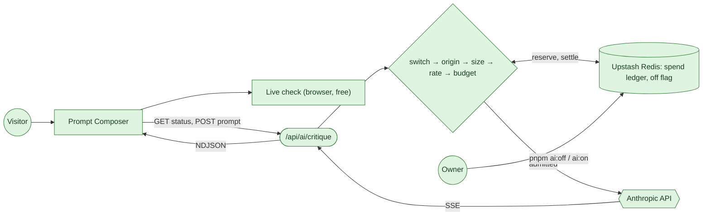

# AI Review: operations, cost and threat model

`POST /api/ai/critique` grades a Prompt Composer prompt with `claude-sonnet-5`
and streams back a scorecard, a top fix, suggested components and a rewrite.
This page covers how to run it, what it costs, how to turn it off, and what
stops strangers from spending the budget.

Code: [`src/lib/ai/`](../src/lib/ai) (route logic),
[`src/app/api/ai/critique/route.ts`](../src/app/api/ai/critique/route.ts)
(wiring), [`scripts/ai-switch.mjs`](../scripts/ai-switch.mjs) (off switch).



## This is API billing, not your Claude plan

The route authenticates with `ANTHROPIC_API_KEY`: pay-as-you-go API credit
from the [Claude Console](https://platform.claude.com). That is a separate
account from a Claude Pro or Max subscription, and the two never touch:

- Visitors' reviews do not count against the plan's weekly limits, so they
  cannot eat into your own Claude Code allowance.
- Running low on the plan does not affect the reviews.
- There is no supported API that reports a subscription's usage, so nothing
  can read "98% of my weekly plan". Using subscription credentials to serve
  other people would also fall outside the consumer terms.

The "turn off automatically before it costs too much" requirement is therefore
built against the API spend itself: a budget this route meters and enforces
(below), plus the Console's own limits as a backstop.

## Setup

1. **Key.** In the Claude Console, create a workspace for this site and an API
   key inside it. A dedicated workspace lets you cap it separately from
   anything else on the account. Set a workspace spend limit at or just above
   `AI_BUDGET_USD`, as the backstop if everything in this document fails. With
   prepaid credits and auto-reload off, an empty balance is a hard stop too.
2. **Shared store.** In Vercel, add **Upstash for Redis** from the Marketplace
   (the free tier is ample) and connect it to the project. It injects
   `KV_REST_API_URL` and `KV_REST_API_TOKEN`. Without it every serverless
   instance keeps its own ledger, and the budget becomes a per-instance budget
   (see [Threat model](#threat-model)).
3. **Environment.** Set the variables below in the Vercel project and redeploy.
4. **Check.** `GET /api/ai/critique` should answer `{"enabled":true}`. Locally,
   `vercel env pull .env.local`, then `pnpm ai:status`.

| Variable                                              | Default | Meaning                                                                                                        |
| ----------------------------------------------------- | ------- | -------------------------------------------------------------------------------------------------------------- |
| `ANTHROPIC_API_KEY`                                   | unset   | Without it the route answers 503 `unconfigured` and spends nothing                                             |
| `AI_REVIEW_ENABLED`                                   | on      | `false`, `off`, `0` or `no` turns review off (needs a redeploy)                                                |
| `AI_BUDGET_USD`                                       | `5`     | Spend limit per period. `0` turns review off by budget. A typo falls back to the default, never to "unlimited" |
| `AI_BUDGET_WINDOW`                                    | `month` | `month` (UTC calendar month) or `week` (ISO week, Monday 00:00 UTC)                                            |
| `AI_BUDGET_CUTOFF`                                    | `0.98`  | Fraction of the budget at which admission stops                                                                |
| `KV_REST_API_URL` / `KV_REST_API_TOKEN`               | unset   | Shared store, as injected by the Vercel Marketplace integration                                                |
| `UPSTASH_REDIS_REST_URL` / `UPSTASH_REDIS_REST_TOKEN` | unset   | The same, as named by a database created directly at upstash.com. Either pair works                            |

## Turning it off

Three switches, fastest first:

| Switch                                   | Speed              | How                                                    |
| ---------------------------------------- | ------------------ | ------------------------------------------------------ |
| `pnpm ai:off "reason"` / `pnpm ai:on`    | within 15 seconds  | Sets or clears a flag in the shared store. No redeploy |
| `AI_REVIEW_ENABLED=false`                | one redeploy       | Vercel project settings, then Redeploy                 |
| Remove `ANTHROPIC_API_KEY`, or revoke it | redeploy / instant | Revoking the key in the Console is the emergency brake |

`pnpm ai:status` prints the switch state and this period's metered spend. The
15-second delay is a per-instance cache that keeps the switch from costing a
store read on every request.

When review is off for any reason, the composer says so and keeps the free
live check working. Visitors never see a dead button.

## The automatic cutoff

Every request is metered, and admission stops before the budget is reached:

1. **Reserve.** Before calling the model, the route adds the request's
   worst-case cost to the period's ledger with an atomic `INCRBY`. Worst case
   means every input byte is a token (a byte-level tokenizer cannot exceed
   that), plus the system prompt, a schema allowance, and the full
   3,072-token output cap. For a short prompt that is about $0.044. If the new
   total would cross `AI_BUDGET_USD × AI_BUDGET_CUTOFF`, the reservation is
   backed out and the request gets 503 `budget`. Because each request reserves
   its worst case up front, requests running in parallel cannot jointly
   overshoot.
2. **Settle.** When the stream finishes, the reservation is replaced with the
   metered cost from the response's `usage` (input and output tokens at the
   rates in [`pricing.ts`](../src/lib/ai/pricing.ts)).
3. **Edge cases.** A stream that is interrupted (the visitor leaves, or the
   upstream errors mid-way) keeps its full reservation, because it was billed
   for tokens the route never saw counted. A request that fails before the
   first token releases its reservation, because nothing was billed. If the
   store is unreachable, the route refuses (fails closed).

So spend is bounded by `AI_BUDGET_USD × AI_BUDGET_CUTOFF` per period, plus at
most one in-flight reservation, since the margin between the cutoff and 100%
is there for exactly that. The ledger resets when the period's key changes.

The prices in `pricing.ts` are copied from Anthropic's price list for
`claude-sonnet-5` ($2 input / $10 output per million tokens). If the model
or its price changes, update both together: the ledger is only as honest as
that table.

### Why not read the real bill?

Anthropic's Admin API has a cost report, which would meter everything on the
account, not just this route. It needs an Admin key, and an Admin key can
create API keys and manage members for the whole organization. Putting that in
a public web function trades a small accuracy gain for a very large blast
radius. The route meters its own calls precisely, and the Console spend limit
covers everything else.

## Cost

Traffic numbers are not in this repository. Vercel Analytics has them. The
per-review figure is measured from the route. Plug the page's monthly visitors
into the table.

**Per review.** The system prompt is about 1,100 tokens (5,020 bytes). With
the schema preamble and a typical 150–400-word prompt, input is about 1,800
tokens. Output is a six-line scorecard, a summary, a top fix and a rewrite
capped at 400 words, about 1,100 tokens including the low-effort thinking.
That comes to 1,800 × $2/M + 1,100 × $10/M = **$0.0146**. This exact case
was run end to end through the route against a fake upstream, and the ledger
recorded 14,600 micro-USD. Plan on **$0.015 per review**, a realistic range of
$0.01–0.025, and a hard worst case of about $0.08 for an 8,000-character
non-Latin prompt.

**Per visitor.** Assume a quarter of Prompt Composer visitors click Review,
and those who do run it about 2.5 times (review, revise, re-review). That is
0.6 reviews per visitor, about **$0.009 per visitor**. Identical re-reviews
are served from a browser cache and cost nothing.

| Prompt Composer visitors / month | Reviews | Cost / month | Against the $5 default budget |
| -------------------------------- | ------- | ------------ | ----------------------------- |
| 50                               | 30      | $0.45        | 9%                            |
| 200                              | 120     | $1.80        | 36%                           |
| 500                              | 300     | $4.50        | 90%                           |
| 1,000                            | 600     | $9.00        | Cut off around day 17         |
| 5,000                            | 3,000   | $45.00       | Cut off around day 3          |

To use this: read the monthly visitors for `/demos/prompt-composer` from
Vercel Analytics and multiply by $0.009. Then compare the real figure after
launch: each review logs one line (below) with its token counts and charge.

**Levers, cheapest first.**

- Raise or lower `AI_BUDGET_USD`.
- Shorten the rewrite cap in the system prompt: output is 75% of the cost.
- Move to `claude-haiku-4-5` ($1 / $5), which roughly halves it. That is a
  quality tradeoff that needs checking against real prompts first, and the
  price table must change with it.

**Abuse ceiling.** Whatever anyone does, a period costs at most the budget,
given the shared store and the Console limit as backstop.

## Observability

Every finished request writes one JSON line to the function log:

```json
{
  "event": "ai.critique",
  "outcome": "complete",
  "stop_reason": "end_turn",
  "input_tokens": 1800,
  "output_tokens": 1100,
  "charged_usd": 0.0146,
  "ms": 6400
}
```

`outcome` is `complete`, `incomplete` (charged the reservation) or `failed`
(charged nothing). The prompt and the review never reach the logs. In Vercel,
filter the function logs on `ai.critique` to total spend or find p95 latency.

## Threat model

An adversarial pass over the route: the ways a public endpoint that spends the
owner's money on strangers' input gets abused, on purpose or by accident, and
what stops each one. Items marked **#298** were fixed before this work. The
rest are new.

| #   | Attack or failure                                                                                                                             | Defence                                                                                                                                                                                                                                                            | Residual risk                                                                                                                 |
| --- | --------------------------------------------------------------------------------------------------------------------------------------------- | ------------------------------------------------------------------------------------------------------------------------------------------------------------------------------------------------------------------------------------------------------------------ | ----------------------------------------------------------------------------------------------------------------------------- |
| 1   | **Denial of wallet across instances.** Rate limits were per serverless instance, so total spend scaled with however many instances Vercel ran | Global spend ledger in the shared store, reserved at worst case before each call                                                                                                                                                                                   | Without Upstash configured, the ledger is per instance too. Set it up                                                         |
| 2   | **Address rotation.** One IPv6 subscriber holds 2^64 addresses, each a fresh bucket                                                           | Per-IP buckets key on the /64                                                                                                                                                                                                                                      | IPv4 botnets and residential proxies still rotate. The ledger bounds what that costs                                          |
| 3   | **Spoofed `X-Forwarded-For`** to mint buckets                                                                                                 | **#298**: `x-real-ip`, else the proxy-appended last entry                                                                                                                                                                                                          | None known                                                                                                                    |
| 4   | **Another site drives visitors' browsers** at the route                                                                                       | **#298**: JSON content type forces a CORS preflight the route never answers. New: `Sec-Fetch-Site` `cross-site` / `same-site` is refused with 403 before the body is read                                                                                          | Non-browser clients omit the header and fall to the limits                                                                    |
| 5   | **Free LLM proxy.** Using the reviewer to do the task ("write my essay")                                                                      | The system prompt forbids performing the task. Structured output forces a fixed scorecard shape. Notes are capped at 25 words, the rewrite at 400 words, and long pasted material becomes a placeholder. Output is capped at 3,072 tokens                          | A determined caller can still extract ~400 words of steered text per call, at 5 calls a minute per address, inside the budget |
| 6   | **Prompt injection** in the reviewed text                                                                                                     | **#298**: fenced in the user turn with every variant of the fence tag escaped; the system prompt is a constant. New: model output is re-validated in the browser (known keys, clamped scores, suggestions limited to catalog ids) and rendered as text, never HTML | An injection can only change what the injector sees. Nothing is stored or shown to anyone else                                |
| 7   | **Oversized or token-dense input**                                                                                                            | **#298**: 16 KB body cap enforced while streaming, 8,000-character prompt cap. New: the reservation is computed from UTF-8 bytes, so dense scripts cannot under-reserve                                                                                            | None known                                                                                                                    |
| 8   | **Spend that is never counted.** Aborted or failed streams                                                                                    | Interrupted streams keep the worst-case reservation, and settlement happens on every exit path exactly once                                                                                                                                                        | Over-counts slightly for aborted streams, which errs toward stopping early                                                    |
| 9   | **Truncation read as success**                                                                                                                | NDJSON framing ends in exactly one `done` or `error` line. The UI shows an interrupted review as interrupted, and flags `max_tokens` truncation                                                                                                                    | None known                                                                                                                    |
| 10  | **Store outage or misconfiguration**                                                                                                          | Store errors fail closed (503). An unparseable `AI_BUDGET_USD` falls back to $5, never to unlimited. A negative value is rejected                                                                                                                                  | An outage turns review off until it recovers, by design                                                                       |
| 11  | **Status endpoint** as an information leak or a store-quota drain                                                                             | Reports on/off and a coarse reason, never figures. Cached 15 seconds per instance                                                                                                                                                                                  | None known                                                                                                                    |
| 12  | **Logs as a privacy leak**                                                                                                                    | One line per request with counts, charge and latency only                                                                                                                                                                                                          | None known                                                                                                                    |
| 13  | **Honest overuse.** One visitor clicking Review repeatedly on the same text                                                                   | A session cache serves an identical prompt's review again at no cost                                                                                                                                                                                               | Small edits are new prompts and cost a review each                                                                            |
| 14  | **Leaked key**                                                                                                                                | The key is read only on the server (`client.ts`) and never reaches the bundle. A dedicated Console workspace with its own spend limit contains the damage                                                                                                          | Revoke and rotate in the Console                                                                                              |

### Deliberately not done

- **Shared per-IP buckets.** Per-IP limits are still per instance. The ledger
  makes that a fairness issue rather than a cost one. The cheap upgrade is a
  Vercel Firewall rate-limit rule on `/api/ai/critique`, which is global,
  per-IP and needs no code. Moving the buckets into Upstash is the in-code
  alternative.
- **Bot detection and CAPTCHA.** Vercel BotID or Turnstile would stop scripted
  callers outright, but each adds a dependency and a visitor-facing cost. Worth
  revisiting if the logs show scripted traffic.
- **Prompt caching.** See the note in `pricing.ts`: the system prompt sits at
  the 1,024-token minimum and traffic is too sparse for reads to repay writes.
